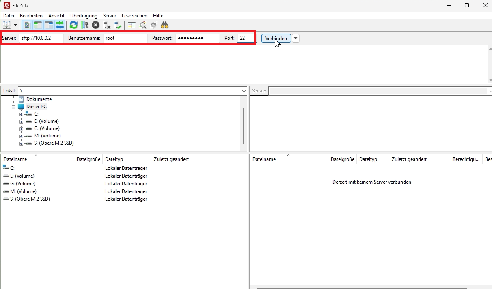

# Pwnagotchi Character Switcher Plugin

This plugin lets you easily switch your Pwnagotchi's **character** — including **face** and **voice** — with a single click through the web interface.

## Features

- Switch between different character personalities directly from the web UI.
- Simple plugin and character folder structure for easy setup.


## Character Preview

<table>
  <tr>
    <td align="center"><strong>Pwan Girl</strong></td>
    <td align="center"><strong>BoyKisser</strong></td>
    <td align="center"><strong>Bat Trinity</strong></td>
    <td align="center"><strong>Motoko</strong></td>
    <td align="center"><strong>Rebecca</strong></td>
    <td align="center"><strong>Edward</strong></td>
  </tr>
  <tr>
    <td></td>
    <td></td>
    <td></td>
    <td></td>
    <td>
      <br/>
      <sub>By <a href="https://github.com/Zerodya" target="_blank">Zerodya</a></sub>
    </td>
    <td>
      <br/>
      <sub>By <a href="https://cyberspacemanmike.com/" target="_blank">Cyberspacemanmike</a></sub>
    </td>
  </tr>
</table

## Disclaimer

This is my first Pwnagotchi plugin. I had a lot of fun building it and I didn't run into any issues while using it.  
That said, **use it at your own risk!**  
If you encounter any problems, feel free to open an issue or contact me.

# Pwnagotchi Character Plugin Installation Guide

This tutorial will guide you step-by-step through the process of installing a character plugin on your Pwnagotchi.

---

## 1. Access your Pwnagotchi via SSH

```bash
ssh pi@10.0.0.2
```


## 2. Set a root password

```bash
sudo passwd root
```
Enter your desired password and confirm it.


---

## 3. Enable root login in SSH

Edit the SSH configuration file:
```bash
sudo nano /etc/ssh/sshd_config
```

Look for the line:
```
#PermitRootLogin prohibit-password
```
Change it to:
```
PermitRootLogin yes
```
Save with `Ctrl+S`, then `Enter`. Exit with `Ctrl+X`.


---

## 4. Restart the SSH service

```bash
sudo service ssh restart
```

---

## 5. Open FileZilla and connect to your Pwnagotchi

- Server: `sftp://10.0.0.2`
- Username: `root`
- Password: your root password
- Port: `22`

Click on "Connect".


---

## 6. Download the Plugin from GitHub

Go to: [https://github.com/CounterChicken/PwnagotchiCharacterPlugin](https://github.com/CounterChicken/PwnagotchiCharacterPlugin)

Click on the green `Code` button and choose `Download ZIP`.

Unzip it on your PC.

---

## 7. Upload the character folder to the root directory

Drag and drop the folder, for example `c_pwangirl`, to the root directory of your Pwnagotchi.


---

## 8. Upload the plugin to the plugin directory

Navigate on the server to:
```
/usr/local/share/pwnagotchi/custom-plugins/
```
Then drag and drop your plugin file (e.g., `pwangirl.py`) from your PC to this folder.


---

You’ve installed your character plugin!

## Notes

This setup works for all character plugins that follow the same structure.  
You can create your own character by providing a plugin file and a matching folder with images and a voice file.  
To create your own plugin file, copy one of the existing ones and adjust the directory and Names accordingly.

## Alternative Usage Without This Plugin

If you want to use the characters (face) without this plugin, you can manually apply the faces using the Face Plugin from this repository:

[https://github.com/roodriiigooo/PWNAGOTCHI-CUSTOM-FACES-MOD](https://github.com/roodriiigooo/PWNAGOTCHI-CUSTOM-FACES-MOD)

## Credits

- **Rebecca** by [Zerodya](https://github.com/Zerodya) !
- **Radical Edward** by [Cyberspacemike](https://cyberspacemanmike.com/) !


